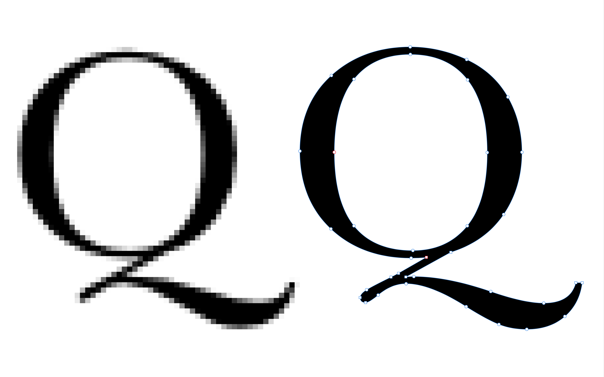
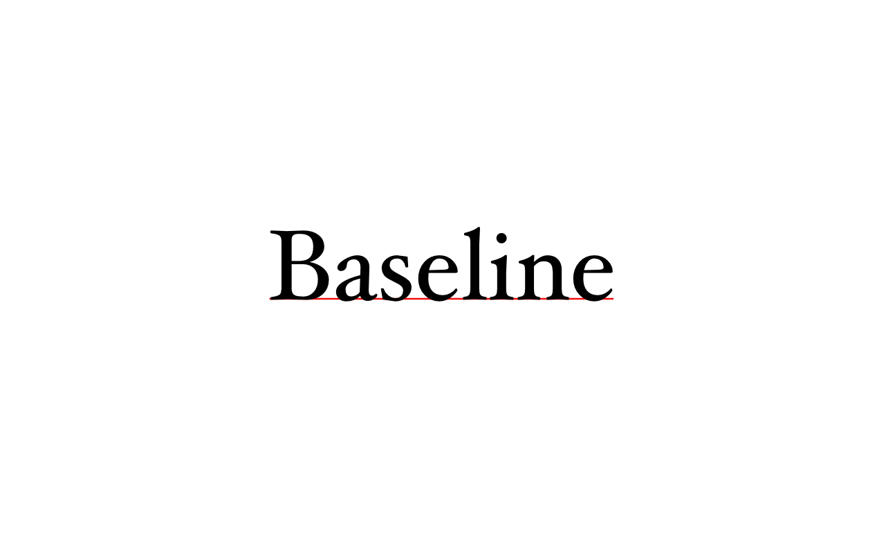
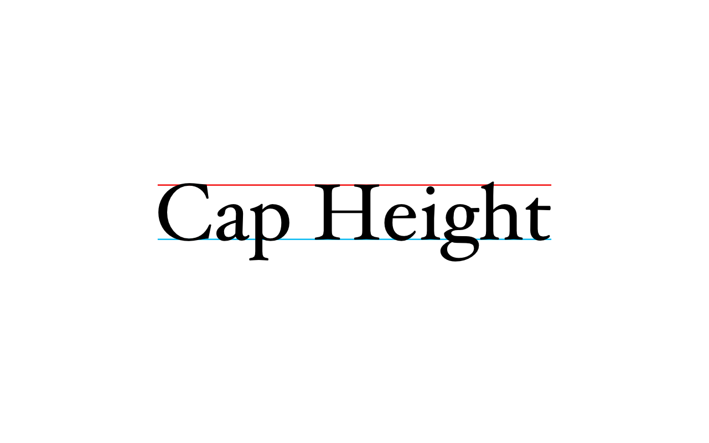
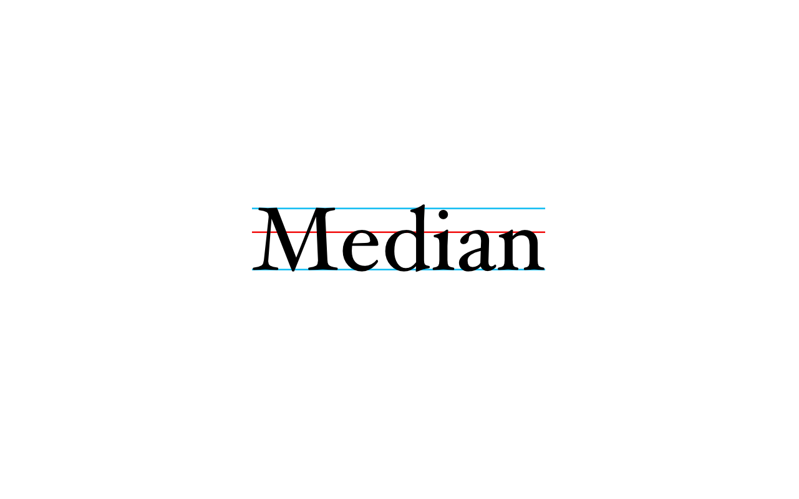
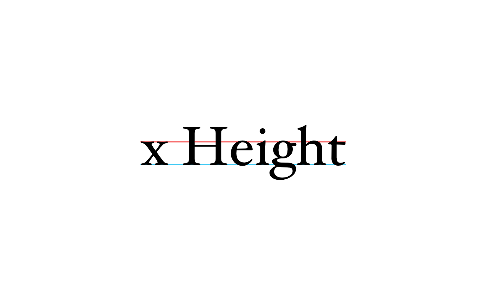
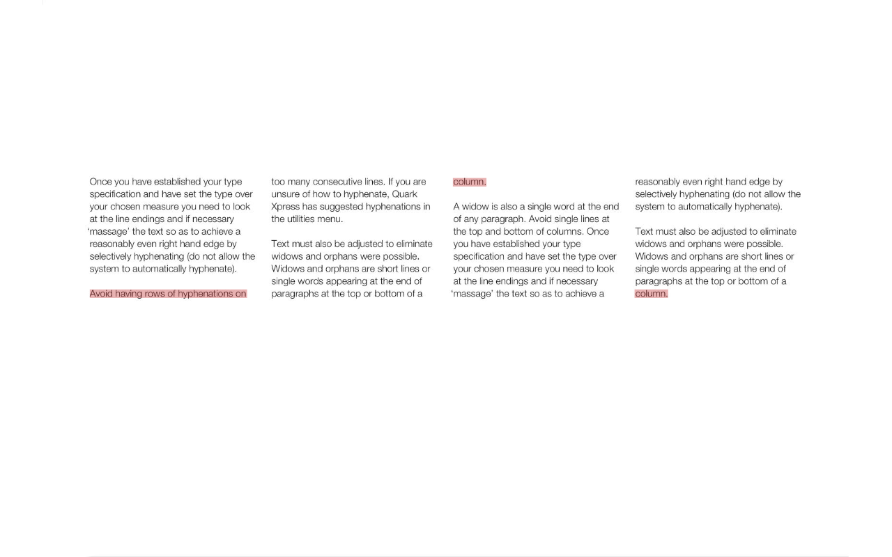
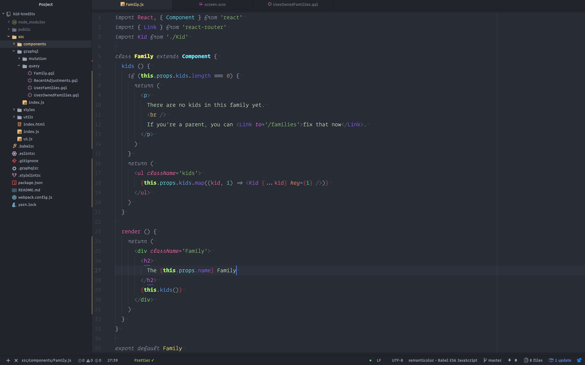
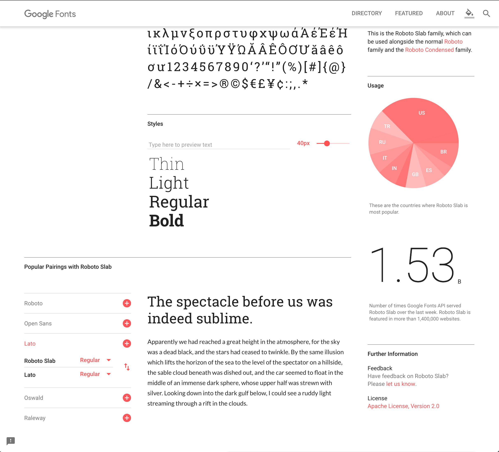
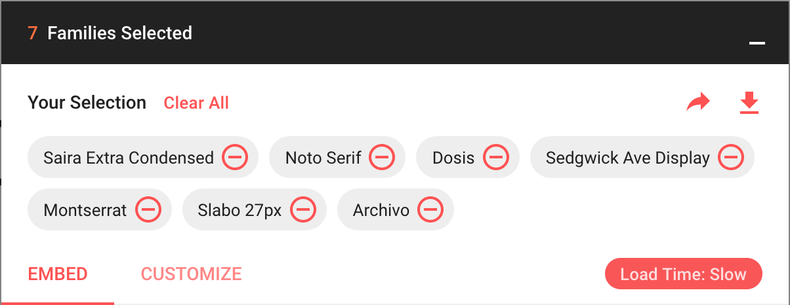

theme: Huerta, 6

# [fit] Typography for Developers


---

# Introduction

> Typography is the art and technique of arranging type.

^ The goal is making written language legible, readable, and appealing
^ Our primary focus in this presentation will be Western type.
^ However, a quick shout-out to:

---

## The Role of Good Type

1. Attract and hold the audience’s attention
2. Be friendly to the reader
3. Establish an information hierarchy
4. Helps to create harmony
5. Creates and build brand recognition

---


^ Non-linear writing Systems
^ Like Braille

---


^ Eastern Calligraphy

---


^ Arabic Abjad

---

## "Font" vs "Typeface"

^ Get this out of the way now.
^ A typeface is a family of fonts sharing common design features


---

^ A font is an alphabet and its associated characters in single style (and historically size).
^ Examples:


---

# A Brief History of Type

---

## Pictograms & Ideograms


^ Written word has evolved over several millennia
^ Good type does not only result in an aesthetic appeal but reduces the void between man and machine.

---

^ Petroglyphs


---

^ Cuneiform


---

^ Hieroglyphics


---

## An Alphabet of Letters

^ Words composed of Phonetic letters rather than pictograms


---


^ 15th century BC, Phoenicians
^ from Cuneiform
^ oldest verified alphabet
^ 22 letters, no vowels
^ right to left in hortizontal lines

---

^ 9th century BC, Greeks
^ Introduction of vowels
^ Ancestor of Latin and Cyrillic scripts.


---

^ 7th century BC, Romans
^ Introduced Serifs, mostly as a result of chiseling tool guides
^ 23 letters in the original Latin alphabet


---

^ Latin Alphabet
^ most used alphabet and writing system in the world today.
^ W added during the middle ages, a ligature of two Vs
^ J and V are even more recent, post-Renaissance, being consonant versions of I and U, which previously, were not considered vowels.


---

^ 6th Century AD, Carolingian minuscule
^ First used of bicameral scripts, capital letters (majuscule) and small (minuscule)
^ Notice the terminology, what do _you_ call these?
^ A calligraphic standard used by the Holy Roman Empire between approximately 800 and 1200 until Blackletter


---

^ Blackletter
^ Coming out of the Middle Ages, books needed to be produced faster, no longer solely for religious work
^ Blackletter was less legible, but quicker to write, conserving space and materials
^ The term Gothic, a synonym for barbaric, was first used to describe this script in 15th-century Italian Renaissance


---

^ Movable Type
^ 1040 AD, Bi Sheng an inventor in the Song Dynasty
^ 400 years before the Gutenberg Press
^ movable components to reproduce the elements of a document
^ Ceramic -> Wood -> Bronze and other metals


---

^ Letterpress
^ 1440, Johannes Gutenberg invents the printing press.
^ Ushered in the, Renaissance, ending the Middle Ages
^ Small number of characters in western languages were a factor in it's success


---

^ Origins of "upper case", "lower case":
^ Capital letters were stored in a separate tray or "case" that was located above the small letters


---

^ 1490, Claude Garamond
^ First typeface designed for print, rather than imitating handwriting.


---

^ Italics, calligraphy-inspired typefaces were first designed in Italy
^ 1500, Aludus Manitus
^ Also invented the "movable book", i.e. today's trade paperbacks
^ Not to be confused with oblique type


---

^ 1734, William Caslon
^ 1757, John Baskerville
^ Transitional Roman
^ Increased contrast between strokes
^ Nearly vertical stress


---

^ 1780, Firmin Didot and Giambattista Bodoni
^ Modern Roman
^ Took transitionals to the extreme, note the hairlines strokes
^ Vertical stress


---

^ 1815, Vincent Figgins
^ Square Serifs
^ Egyptian, or "slab serif"


---

^ William Caslon IV
^ 1816, First sans-serif type
^ mocked in it's time


---

^ 1880s, Hot metal typesetting,
^ Mergenthaler Linotype Company, Linotype Machine would cast on the fly, an entire line of text as one metal slug


---


^ Monotype system, two machine, A keyboard for setting type, generated a punched paper type used by the casting machine
^ Monotype eventually acquires Linotype, exists today selling digital type.


---

^ Etaoin shrdlu
^ Predecessor to "Lorem Ipsum"
^ order of frequency of 12 most commonly used letters


---

^ 1873, Typewriters and QWERTY
^ The idea of a CR and LF


---

#### 20th Century

^ Type design becomes a full time profession
^ Goudy, Bayer, Morison


---

^ 1954, Max Miedinger create Helvetica
^ Swiss, use of white space as design
^ Most popular typeface of our time


---

^ Phototypesetting
^ 1950s, a photographic process, i.e. projecting light through a negative image onto photo paper
^ Diatype (machine)


---

^ 1960s, Letraset Type Lettering System
^ First with a wet transfer process, not unlike temporary tattoos, later a dry rub transfer
^ Used extensively in design, advertising, by artists and architects until the 1980s and the advent of desktop publishing


---

^ Popularized the use of Lorem Ipsum as place holder text.


---

^ Digi Grotesk,
^ 1964, First digital font
^ designed for use in cathode ray typesetting machines, which set text by projecting a CRT image
^ basically a TV image — onto photosensitive paper through a lens


---

^ Dot Matrix Printers
^ given the text itself as input
^ characters drawn as a series of dots, defined by the printer


---


^ Adobe & PostScript
^ 1985, still the standard in publishing
^ Storing mathematical calculations of type rather than bitmaps
^ Adobe led the way in developing fonts for personal computers



---

^ Apple & TrueType
^ 1989, in partnership with Microsoft
^ Rejected PostScript in favor of their own
^ Less reliable, but exploded in popularity
^ Used quadratic Bézier curves, faster and simpler
^ Required more points to express the same shape


---

^ Microsoft & OpenType
^ Mid-1990s, in partnership with Adobe
^ Cross platform, developed
^ Support for expanded character sets
^ Typographic features like ligatures
^ Created to supersede both TTF and PS
^ Can use TrueType format curves or CFF, based on PostScript


[OpenType Features](https://www.typogama.com/opentype-features)

---

# Typographic Vocabulary

---

## Landmarks

---


^ Baseline
^ The horizontal imaginary line where the bottoms of most letters are aligned



---

^ Cap height
^ The height of flat upper case letters, like "H" or "I"



---

^ Median
^ Between the baseline and cap height, top of the x-height



---

^ X-height
^ Typically the height of the lowercase ‘x’.
^ One of the most important dimensions of a font
^ used to define relative difference in height between upper and lower-case letters



---

## Anatomy of Type

---


### Bar / Cross Stroke

^ The horizontal stroke on the characters ‘A’, ‘H’, ‘T’, ‘e’, ‘f’, ‘t’.


---

### Counter

^ The empty space inside a closed stroke.


---

### Bowl

^ The curved stroke which surrounds a counter.


---

### Ascender

^ The stroke of a lowercase character extending above the x-height.


---

### Descender

^ The stroke of a lowercase character extending below the baseline.


---

### Serif

^ Tapered corners on the ends of the main stroke.


---

### Bracket

^ A curved line connecting the serif to the stroke.


---

### Terminal

^ The end of a stroke which does not terminate in a serif.


---

### Ball Terminal

^ The end of a stroke with a circular form


---

### Stem

^ A stroke which is vertical or diagonal,
^ usually the main stroke of a letter


---

### Shoulder

^ The part of a curved stroke coming from the stem.


---

### Axis / Stress

^ The direction a curved stroke changes weight.


---

### Swash, Finial, and Tail

^ Exaggerated flourish, most often seen in italic serif typefaces
^ A descending stroke, often decorative, as on a Q, R, K
^ Curved terminal
^ Sometime descenders on g, j, p, q, and y are called tails


---

### Tittles & Diacritics

^ Small distinguishing mark, such as a diacritic or the dot on a lowercase i or j
^ Diacritic is a glyph added to a letter, or basic glyph


---

### Vertex / Apex

^ Outside point at the bottom or top of a character where two strokes meet, V, W
^ Apex being on the top, as in A


---

### Crotch

^ An acute, inside angle where two strokes meet.
^ Opposite the vertex


---

### Spur

^ A small projection off a main stroke.


---

### Lobe

^ A rounded projecting stoke attached to the main structure of a letter.
^ R, P, B, D


---

### Overshoot

^ Portions of letters that extend beyond the space of normal "flat" letters
^ Typical of rounded letters


---

### Aperture

^ The partially enclosed negative space in some characters
^ Like an "open" counter, e.g. n, c, s,

-

--

### Spine

^ curved stroke of an S


---

### Eye

^ The small counter of a lowercase "e"


---

### Ear

^ Small stroke on the lowercase double-story "g", or on some lowercase "r"


---

### Link

^ Connects the top and bottom bowls of lowercase double-story "g"


---

### Loop

^ The bottom part of the lowercase roman "g", the link _and_ the bowl


---

## Typographic Measurements

---

### Points

^ smallest unit of measure
^ font size, leading, etc on a _printed_ page
^ It's size has varied through History
^ In modern typography, it is 1⁄72 of an inch
^ 1 / 12 of a pica
^ In CSS, abbreviated as `pt`


---

### Pica

^ 12 points
^ 1⁄6 of an inch
^  1⁄72 of a foot
^ In CSS, abbreviated as `pc`


---

### Em

^ In a font, one em is the point size of that font, e.g. in an 18 point font, 1em is 18 points
^ Traditionally, the width of a capital "M"


---

### En

^ half of the width of an em.
^ Usually, half of the height of the font
^ Traditionally the width of a capital "N"
^ These are all subjective and have varied through history and typefaces

---


^ dashed, hyphens, and minus: similar in appearance but differ in length and function.

---

^ En dashes used for ranges
^ Sometimes called "nut"

---

> A flock of sparrows—some of them juveniles—alighted and sang.

^ EM dash is used to break a thought, or like parenthesis

---

^ Hyphen is used to join words

> We, therefore, the represen-  
> tatives of the United States
> of America...

---

### Figure Dashed, Thin, Hair, Paren Space

^ Various other measurements of width and whitespace

---

## Other Terminology

---

### Ligature

^ Two or more graphemes or letters joined into a single glyph


---

### Kerning

^ The adjustable distance between a single pair of characters
^ Very important to achieving aesthetic type
^ Not to be confused with tracking


---

^ Tracking
^ Distance between characters applied globally
^ Controlled with `letter-spacing` in CSS


---

### Leading

^ Line spacing
^ Controlled with `line-height` in CSS


---

### River

^ Gaps in typesetting running through a paragraph of text
^ Caused by coincidental alignment of spaces


---

### Widows and Orphans

^ Widow, a paragraph _ending_ line by itself at the _beginning_ of the following page or column
^ Orphan, a paragraph _opening_ line by itself at the _bottom_ of a page or column
^ "An orphan has no past; a widow has no future"
^ "An orphan is left behind, whereas a widow must go on alone"
^ "An orphan is alone from the beginning; a widow is alone at the end"



---

### Alignment / Justification


---

#### Flush Left / Ragged Right


---

#### Flush Right / Ragged Left


---

#### Justified


---

#### Centered


---

## Classification of Type

^ classification describes typefaces; it does not define them
^ subjective and incomplete, many systems exist

---

### Serif and Sans Serif

^ Primary two classifications


---

## Serifs

---

## Humanist / Old-Style

^ strong calligraphic influence
^ This Adobe Garamond
^ low contrast between thick and thin lines
^ Diagonal stress


---

## Transitional

^ More pronounced contrast
^ More vertical stress
^ This is Times New Roman


---

## Modern

^ Very strong contrast
^ vertical stress
^ Bodini


---

#### Egyptian / Slab

^ This serifs, often as thick as other strokes
^ Clarendon


---

### Sans Serifs

^ No serifs
^ Almost always a vertical axis

---

#### Grotesque

^ Very awkward, many of the original typefaces consisted only of capital letters


---

#### Neo-Grotesque / Realist

^ much less variation in line weight
^ single-story "a" and "g"
^ Univers, Helvetica
^ simplicity does not directly translate into legibility
^ tight vertical rhythm and pinched apertures keep many (including Helvetica) from being good choices for body text


---

#### Humanist

^ strong calligraphic influence
^ stroke contrast
^ slanted axis, or "stress"
^ double-story "a" and "g"
^ improved legibility


---

#### Geometric

^ Derived from geometric shapes rather than handwriting
^ circular bowls, very rectangular
^ Many common components between glyphs
^ Futura


---

## Practical Editing

^ One of the most important ways we can use typography, is how we interact with type every day, in our programming environments.

---

### Monospace Type

^ aka Fixed-width
^ Most type designs are proportional in width


---

^ Pros
^ Alignment is the most important reason we use mono-spaced fonts in programming
^ Dot-matrix printers and type writers produced fixed width type
^ Early terminals were fixed to 80 characters wide
^ Improved legibility for the small symbols frequently used as operators


---

^ Cons
^ Reduced legibility for prose


---

### Legibility

^ Typefaces designed specifically for programming will include legibility improvements:
^ 0 O o
^ I, i, l, 1


---

^ Distinctive braces and brackets
^ carefully designed letters that are normally thin to compensate for lack of kerning
^ Operator Mono


---

^ Ligatures
^ Many of the multi-character operators we use in programming are derived from the more complex typographic glyphs (often mathematical)
 simplified for typing on a standard keyboard.
^ OpenType format and modern editors allow us to present these characters with beautiful ligatures.
^ Some fonts include:


---

- [Monoid](http://larsenwork.com/monoid/)
- [Fira code](https://github.com/tonsky/FiraCode)
- [Iosevka](https://be5invis.github.io/Iosevka/)
- [Haskling](https://github.com/i-tu/Hasklig)

---

### Syntax Highlighting

^ colors are applied to words known ahead of time (language keywords), and operators, symbols, and other syntactic elements of code
^ highlight on language-specific keywords, operators and similar elements, which have the same meaning in anyone's code
^ It can only highlight by what the code _looks like_, but not what the code _means_


---

### Semantic Highlighting

^ instead of the built-in keywords being highlighted, everything else is.
^ attempts to parse out what's important about _your_ code -- what it means
^ Each keyword or variable name has its own color
^ At a glance, it becomes easy to follow data through the code


---

^ Personal Editor Setup
^ A mix of four fonts
^ Inverted comments
^ Ligatures for symbols
^ Mix of weight and italics for different keywords and constants
^ Reduced opacity of unimportant symbols



---

## Type for the Web

---

### History


---

#### Font Tag

^ Not until HTML 3.2 in 1995
^ Font had to be installed on the computer or a fall back was used

```HTML
<P><FONT face="Times New Roman, Times, serif"><I>© 1994 <B>www.twaxdotcom.com</B>
All Rgihts Reserved.</I></FONT></P>
```

---

^ CSS
^ 1996, provided same functionality as the font tag


---

#### Web-safe fonts

^ Likely to be present on a wide range of computer systems

```css
h1 {
  font-family: "Century Gothic", CenturyGothic, AppleGothic, sans-serif;
  font-size: 24px;
  font-style: normal;
  font-variant: normal;
  font-weight: 500;
  line-height: 26.4px;
}
```

---

^ Microsoft's Core fonts for the Web
^ Originally: Arial, Courier New, Times New Roman, Comic Sans, Impact, Georgia, Trebuchet, Webdings and Verdana
^ Defacto fonts for the web, despite not being present on most Mac and Linux systems


---

#### CSS3

^ CSS2 Attempted to include a specification for font downloading, removed in CSS2.1
^ fonts module, widely used today, greatly improved web typography

```css
@font-face {
  font-family: 'Fooberry';
  src: url('/fonts/fooberry.woff') format('woff'),
       url('/fonts/fooberry.svg#Fooberry') format('svg'),
       url('/fonts/fooberry.ttf') format('truetype'),
       url('/fonts/fooberry.eot'),
       url('/fonts/fooberry.eot?#iefix') format('embedded-opentype');
  font-weight: normal;
  font-style: normal;
}
```

---

### Selection & Pairing

---

^ We're not Designers
^ Don't try to be, if you aren't comfortable with it
^ Use recommended pairings, like wine with foods
^ Search for inspiration and borrow / steal it
^ No need to re-invent the wheel here



---

^ Rules of Thumb
^ Plenty of variety in the variants of a single family
^ If there's not enough variety there, two typefaces is probably enough, one serif, one sans
^ In _print_ Sans Serif is often used for display text, and serifs for body text.
^ In modern web design, this isn't always true, again look to recommendations if you aren't sure


---

### Unity in Variety

> a principle that aesthetic value or beauty in art depends on the fusion of various elements into an organic whole which produces a single impression
-- MERRIAM-WEBSTER

---

^ Hokusai, “The Great Wave off Shore at Kanagawa”
^ repetitions of shapes to create chaos
^ Whitecaps on the waves in the foreground mimic the snow atop Mount Fuji in the distance
^ Carefully arranged solids and voids in his composition to create opposing but balancing areas of interest.
^ the two areas compete for attention, neither possible without the other
^ Apply this to type by looking for typefaces that have some similar qualities but also create complimentary contrast


---


### Grid Systems

^ Difficult to a achieve fully aligned 2D grids in CSS
^ until now, CSS grid layouts will help this
^ Choose a Baseline Size
^ Use multiples of them as much as possible
^ Whitespace, gutters, leading aka padding/margins
^ Sass helps with this


---

### Vertical Rhythm

^ keeping vertical spaces between elements on a page consistent with each other.


---

### Hierarchy

^ Look at what you are trying to say and assign a hierarchy of information to it using size, scale and color.
^ Use things like borders and shadows to add variety to certain elements
^ Use the same border style, use the same shadow size, color, radius
^ Again, Sass helps with this


---

### Performance Considerations

---

#### Download Time

^ Yes, this is still a thing.
^ Too many fonts in addition to throwing a design into chaos also dramatically impact performance
^ When selecting fonts from Google, pay attention to the meter
^ Google fonts also gives you the benefit of common fonts likely being cached
^ Use Chrome Dev tools
^ Download budget



---

^ Any Questions?


---

## Resources

- [Operator Mono](https://www.typography.com/blog/introducing-operator)
- [Coding in Color](https://medium.com/@evnbr/coding-in-color-3a6db2743a1e)
- [My ETC, including Atom config](https://github.com/ambethia/etc)
- [CSS Font Stack](http://www.cssfontstack.com) - A complete collection of web safe CSS font stacks.
- [Core fonts for the Web](https://www.microsoft.com/typography/fonts/web.aspx)
- [Google Fonts](https://fonts.google.com)
- [Font Pair](http://fontpair.co) - Suggested pairings from Google Fonts
- [Web Font Performance](https://www.keycdn.com/blog/web-font-performance/)
- [Why Vertical Rhythms](https://zellwk.com/blog/why-vertical-rhythms/)
- [The Grid System: Building a Solid Design Layout](https://www.interaction-design.org/literature/article/the-grid-system-building-a-solid-design-layout)
- [Designing Type Systems](http://ilovetypography.com/2012/04/11/designing-type-systems/)
